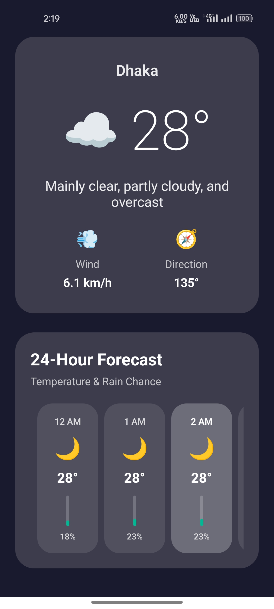
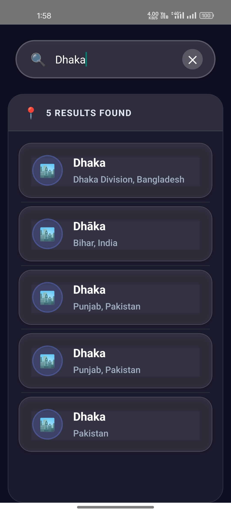

# 🌤️ Skyscout – React Native Weather App

[Download APK](./assets/app-release.apk) 📲  
[Demo Video Link](https://drive.google.com/file/d/1tLMJvpc0JAEicbseLP_SM7mWw1NW8i2o/view?usp=drivesdk) 🎥 

Skyscout is a modern **React Native mobile application** that provides real-time weather data and 12-hour precipitation forecasts.  
It is built with **TypeScript** and follows **industry-standard best practices** to ensure scalability, performance, and maintainability.

---

## 🖼️ Screenshots

| Current Weather | City Search | Animated Loader | Current Weather |
|------------|----------------|------------|----------------|
|  |  |  |  |

---

## 🚀 Features

- 📍 **Location-based Weather**  
  Automatically fetches weather data using device geolocation (with permission handling).

- 🏙️ **City Search**  
  Allows users to search for a city and get its live weather conditions.

- ⏳ **Hourly Forecast**  
  Displays precipitation probability and other conditions for the next 12 hours.

- ⚡ **Offline Storage**  
  Uses `AsyncStorage` to cache location and user preferences for quick reloads.

- 📱 **Cross-Platform**  
  Works on both **Android** and **iOS** with a consistent UI.

---

## 📦 Tech Stack

- **React Native CLI** (not Expo) – for full native integration.  
- **TypeScript** – type safety and maintainability.  
- **Open-Meteo API** – free, reliable weather API (no key required).  
- **AsyncStorage** – local persistence for caching.  
- **react-native-permissions** – fine-grained permissions for location.  
- **react-native-geolocation-service** – precise geolocation handling.  

---

## 🛠 Installation & Setup

### Prerequisites
- Node.js ≥ 18
- Yarn or npm
- Android Studio / Xcode
- React Native CLI (`npx react-native`)

---

### 1️⃣ Clone the repository
```sh
git clone https://github.com/Hasib98/Skyscout-Mobile-App.git
cd Skyscout-Mobile-App
2️⃣ Install dependencies
sh
Copy
Edit
# Using npm
npm install

# OR using Yarn
yarn install
3️⃣ Android Build Setup
sh
Copy
Edit
cd android
./gradlew clean          # Optional: only if you face build issues
cd ..
npx react-native run-android
After the build completes, you can start Metro Bundler separately if needed:

sh
Copy
Edit
npx react-native start
4️⃣ iOS Setup (macOS only)
sh
Copy
Edit
cd ios
bundle install           # one-time
bundle exec pod install
cd ..
npx react-native run-ios
📂 Project Structure
bash
Copy
Edit
Skyscout-Mobile-App/
├── android/            # Native Android project
├── ios/                # Native iOS project
├── src/
│   ├── components/     # Reusable UI components
│   ├── hooks/          # Custom React hooks (location, API, etc.)
│   ├── screens/        # App screens (Weather, Search, etc.)
│   ├── services/       # API clients (Axios, Open-Meteo)
│   ├── utils/          # Utility functions
│   └── App.tsx         # Entry point
├── assets/             # Images, APK, other static assets
├── package.json
└── README.md
✅ Best Practices Followed
TypeScript everywhere – for reliability and fewer runtime bugs.

Separation of concerns – UI, logic, and API handling are clearly separated.

Reusable components – built atomic UI components to avoid duplication.

Hooks-based architecture – custom hooks (useLocation, useWeather) for clean state management.

Error handling & fallback UI – graceful handling of API errors and location permission denials.

AsyncStorage caching – optimized performance with local persistence.

Theming & Dark Mode – consistent user experience across devices.

Clean Git history & commits – meaningful commit messages and branch strategy.

🧑‍💻 Development Guidelines
Run npm run lint before committing – ensures code quality.

Follow React Native community style guide.

PRs require code review before merge (if working in a team).

🐛 Troubleshooting
If Metro bundler fails, restart with:

sh
Copy
Edit
rm -rf node_modules
npm install
npm start --reset-cache
On Android emulator not detecting location, enable GPS in Emulator Settings.

On iOS CocoaPods errors, try:

sh
Copy
Edit
cd ios && pod deintegrate && pod install
🚀 Roadmap / Future Improvements
🌍 Multi-language support.

🔔 Push notifications for severe weather alerts.

📊 Charts for temperature & rainfall trends.

🧭 Integration with maps for regional forecasts.

💾 Offline mode with last cached forecast.

📜 License
This project is licensed under the MIT License. Feel free to use and modify it.

✨ Author
👤 S. M. Hasib

🌐 Portfolio

💼 LinkedIn

🎨 Behance

🏆 NASA Space Apps & Blockchain Olympiad Finalist